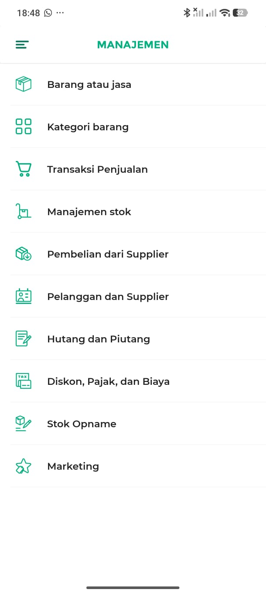
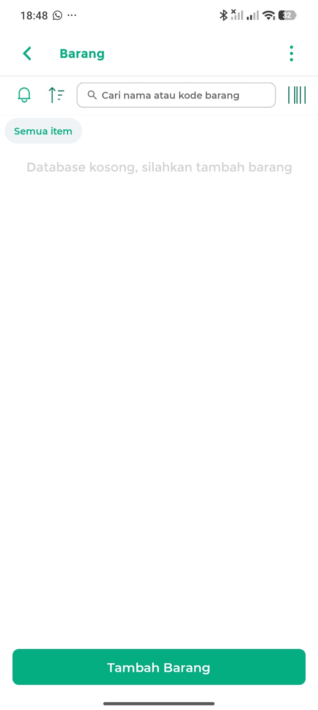
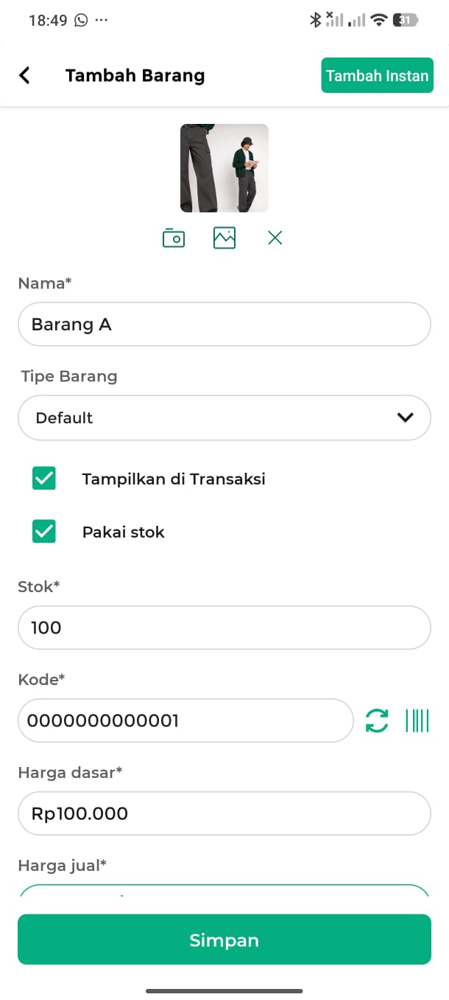
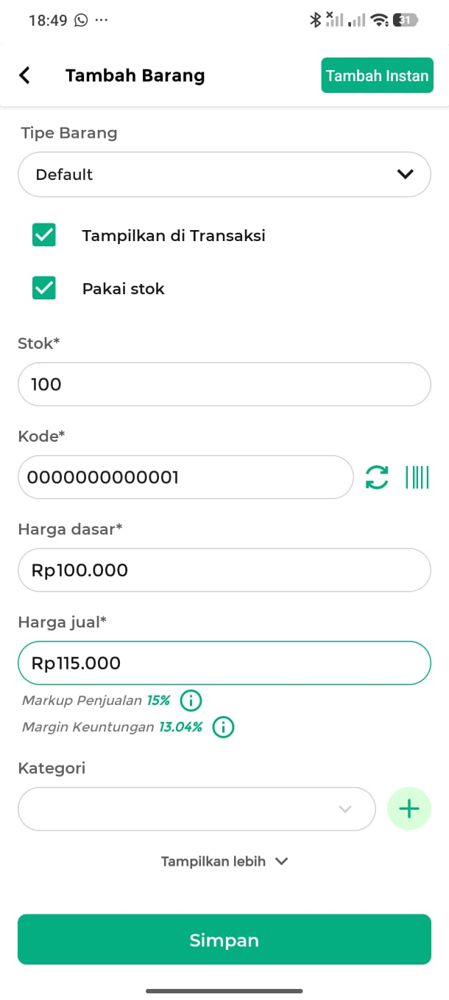
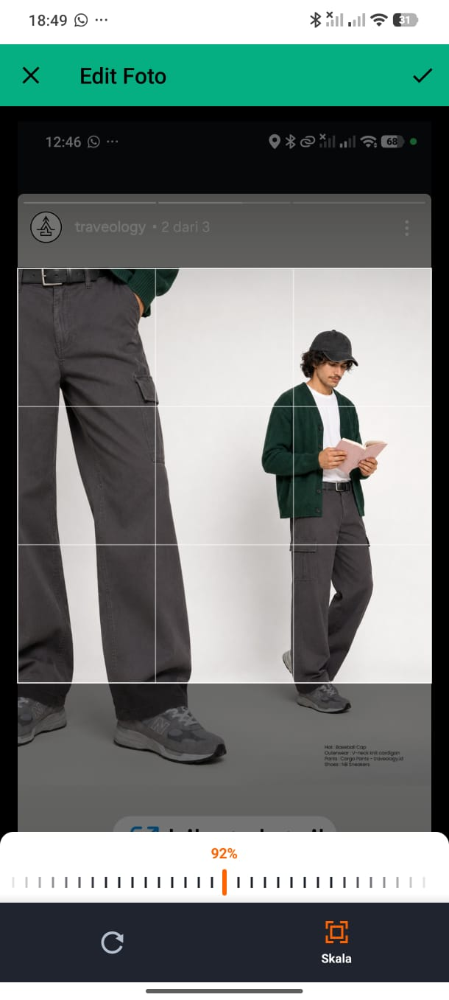
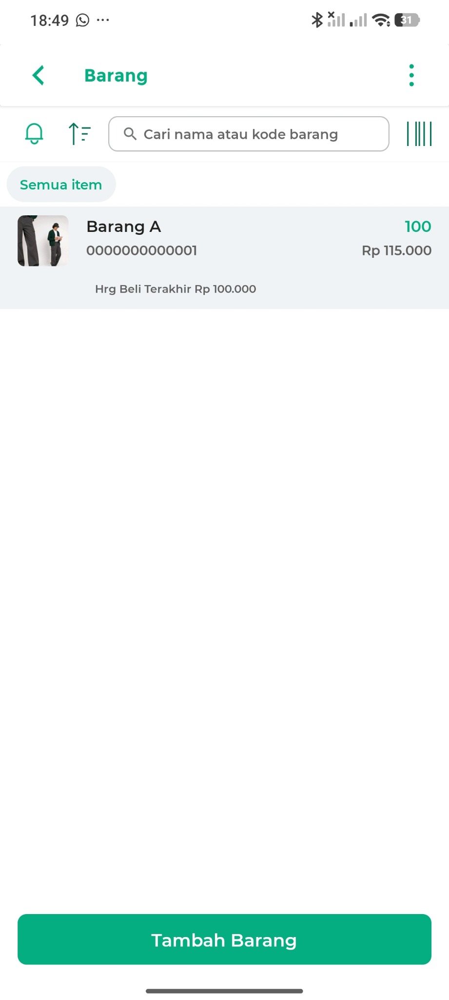
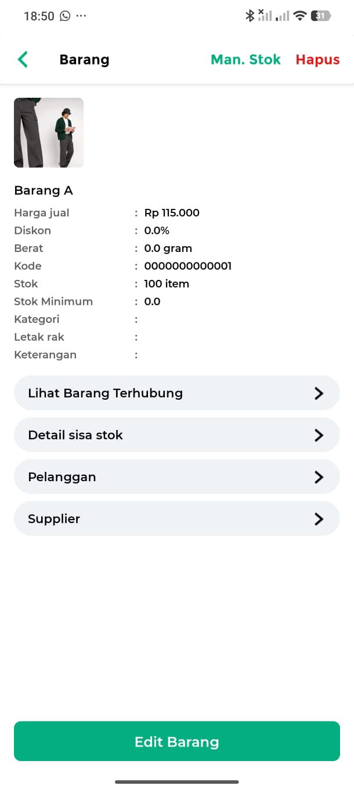
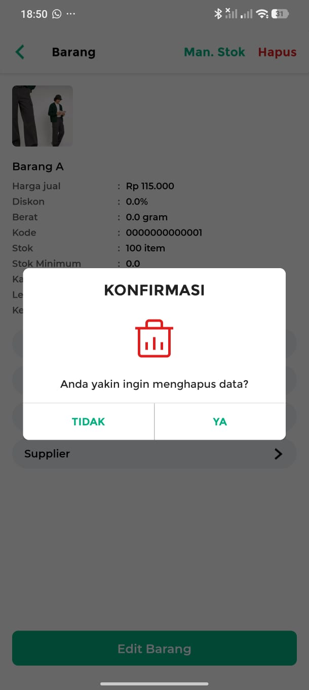

# Referensi UI dan pemetaan flow

Screenshot berikut menjadi acuan fallback locator dan urutan proses ketika APK serta hierarchy Appium Inspector belum tersedia.

## 1. Buka menu Barang

Masuk dari halaman `MANAJEMEN`, lalu pilih `Barang atau jasa`.

## 2. Kondisi awal daftar Barang

Daftar dapat kosong dan menyediakan tombol `Tambah Barang`.

## 3. Create Barang tipe Default

Field wajib yang diautomasi adalah Nama, Stok, Kode, Harga dasar, dan Harga jual. Nilai `Tipe Barang` harus `Default`, lalu data disimpan melalui tombol `Simpan`.

Upload dan crop foto terlihat pada aplikasi, tetapi tidak menjadi field wajib pada task CRUD.

## 4. Read melalui daftar dan detail

Data diverifikasi dari hasil pencarian serta halaman detail. Assertion mencakup nama, kode, stok, dan harga jual.

## 5. Update dan Delete

Update dimulai melalui tombol `Edit Barang`. Delete dimulai melalui `Hapus` dan hanya dilanjutkan setelah dialog `KONFIRMASI` disetujui dengan tombol `YA`.

